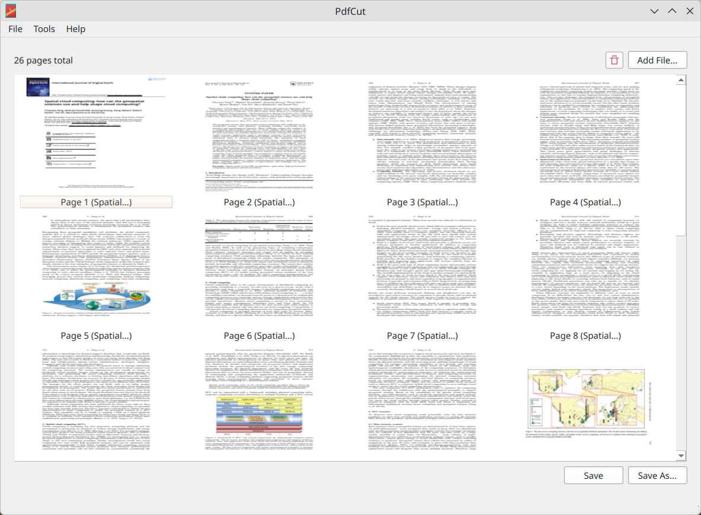

<div align="center">


</div>

# PdfCut
*A lightweight application for cutting, merging and extracting pages from PDF documents.*

<div align="center">



</div>

## Installation

You can either choose a precompiled binary for your system under **Releases**, or build the project yourself. Building instructions can be found under the *Building and contribution* section.

## Usage

- Use the **Add File...** action from the **File** menu, or the **Add File...** button from the start screen or the toolbar to add the pages of a file to the workspace. The **Open File...** menu action will close all the currently opened pages and add a file similarly.

- To reorder the pages, simply drag and drop them to the desired place. 

- To remove a page, first select it, then use the **Delete selected page** action from the **Tools** menu, or click the button with the bin symbol in the toolbar. You can remove all pages with the **Clear all** action from the **Tools** menu.

- If you only have a single file open, clicking the **Save** button will overwrite that file. The **Save as** button can be used with any number of open files greater than one, and will save a new file to the selected location.

## Feedback

If you encounter a bug, or have a suggestion or feature request, please create a new issue under the **Issues** tab on GitHub.

## Third-Party Licenses

This project uses Qt 6 (LGPLv3), qpdf (Apache 2.0), and app icons from the KDE project (LGPL).

Their project pages can be found here:

- [Qt](https://www.qt.io/)

- [qpdf](https://github.com/qpdf/qpdf)

## Building and Contribution

### Prerequisites

Before building, ensure you have the following installed on your system:
- **C++ Compiler** with C++17 support
- **CMake** (version 3.16 or higher)
- **Qt** (version 6.11.0) with the `Widgets` and `Pdf` modules
- **qpdf** library

### Building from source

1. **Clone the repository:**
   ```bash
   git clone https://github.com/m4cri/PdfCut.git
   cd PdfCut
2. **Create a build directory:**
    ```bash
    mkdir build
    cd build
3. **Generate the build files with CMake:**
    ```bash
    cmake ..
4. **Compile the project:**
    ```bash
    cmake --build .
5. **Once the compilation is finished, you can find the ``PdfCut`` executable in your ``build`` directory.**

### Contributing
Contributions are always welcome! If you'd like to improve PdfCut, please follow the standard GitHub workflow:

1. Fork the repository on GitHub.

2. Clone your forked repository to your local machine.

3. Create a new branch for your feature or bug fix:

    ```bash
    git checkout -b feature/my-new-feature

4. Make your changes, ensuring the project builds successfully and functions as expected.

5. Commit your changes with clear and descriptive commit messages:

    ```bash
    git commit -m "Add new feature X"

6. Push the branch to your fork:

    ```bash
    git push origin feature/my-new-feature

7. Open a Pull Request against the main repository and describe your changes in detail.

For significant architectural changes or large new features, please consider opening an issue first to discuss the implementation before you start writing code.
